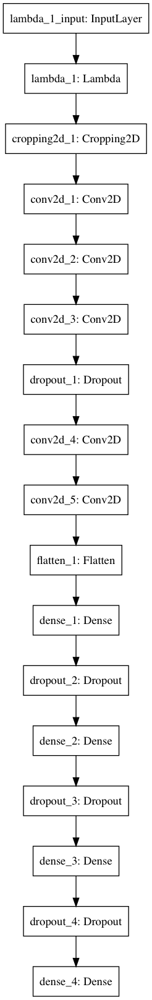

# **Behavioral Cloning**

**Behavioral Cloning Project**

The goals / steps of this project are the following:
* Use the simulator to collect data of good driving behavior
* Build, a convolution neural network in Keras that predicts steering angles from images
* Train and validate the model with a training and validation set
* Test that the model successfully drives around track one without leaving the road
* Summarize the results with a written report


## Rubric Points
### Here I will consider the [rubric points](https://review.udacity.com/#!/rubrics/432/view) individually and describe how I addressed each point in my implementation.  

---
### Files Submitted & Code Quality

#### 1. Submission includes all required files and can be used to run the simulator in autonomous mode

My project includes the following files:
* model.py containing the script to create and train the model
* drive.py for driving the car in autonomous mode (unchanged)
* model.h5 containing a trained convolution neural network
* writeup_report.pdf summarizing the results
* video.mp4 video documenting autonomous driven lap

#### 2. Submission includes functional code
Using the Udacity provided simulator and my drive.py file, the car can be driven autonomously around the track by executing
```sh
python drive.py model.h5
```

#### 3. Submission code is usable and readable

The model.py file contains the code for training and saving the convolution neural network. The file shows the pipeline I used for training and validating the model, and it contains comments to explain how the code works.

### Model Architecture and Training Strategy

#### 1. An appropriate model architecture has been employed

My model consists of a neural network with 5 convolution layers, followed by 4 fully connected layers (model.py lines 78-95).

The images are cropped to not include sky (model.py line 81).
The data is normalized in the model using a Keras lambda layer (code line 80).

#### 2. Attempts to reduce overfitting in the model

The model contains dropout layers in order to reduce overfitting (model.py lines 85, 90, 92 and 94).

The model was tested by running it through the simulator and ensuring that the vehicle could stay on the track.

#### 3. Model parameter tuning

The model used an adam optimizer, so the learning rate was not tuned manually (model.py line 97).

#### 4. Appropriate training data

Training data was chosen to keep the vehicle driving on the road. I used mostly a training set where I drove in the center of the lane from track one. Some recovery from the sides, and a full lap of reverse track driving (to compensate from the track being mostly left turns).

### Model Architecture and Training Strategy

#### 1. Solution Design Approach

The overall strategy for deriving a model architecture was to test the network architecture from the paper from Nvidia (End to End Learning for Self-Driving Cars)[1].

I tried to train the network based on the provided driving data, but the car ended up leaving the track just after the bridge. It simply could not make the sharp left turn.

I then tried to drive three full laps with a few recovery from sides, followed by a reverse lap. The reverse lap was to compensate for the fact that the track is mostly left turns.

I trained the network once more and after running the simulator, the car was able to drive the track without any problems.

#### 2. Final Model Architecture

The final model architecture (model.py lines 78-95) consisted of a 9 layer neural network. 5 convolution layers, followed by 4 fully connected layers.

The whole network is shown in the figure below.



The number of parameters are shown in the table below.


| Layer (type)              | Output Shape        | Param # |
|---------------------------|---------------------|---------|
| lambda_1 (Lambda)         | (None, 160, 320, 3) | 0       |
| cropping2d_1 (Cropping2D) | (None, 65, 320, 3)  | 0       |
| conv2d_1 (Conv2D)         | (None, 31, 158, 24) | 1824    |
| conv2d_2 (Conv2D)         | (None, 14, 77, 36)  | 21636   |
| conv2d_3 (Conv2D)         | (None, 5, 37, 48)   | 43248   |
| dropout_1 (Dropout)       | (None, 5, 37, 48)   | 0       |
| conv2d_4 (Conv2D)         | (None, 3, 35, 64)   | 27712   |
| conv2d_5 (Conv2D)         | (None, 1, 33, 64)   | 36928   |
| flatten_1 (Flatten)       | (None, 2112)        | 0       |
| dense_1 (Dense)           | (None, 100)         | 211300  |
| dropout_2 (Dropout)       | (None, 100)         | 0       |
| dense_2 (Dense)           | (None, 50)          | 5050    |
| dropout_3 (Dropout)       | (None, 50)          | 0       |
| dense_3 (Dense)           | (None, 10)          | 510     |
| dropout_4 (Dropout)       | (None, 10)          | 0       |
| dense_4 (Dense)           | (None, 1)           | 11      |


Total params: 348,219

During training the network also applies a few dropout layers to prevent overfitting.


#### 3. Creation of the Training Set & Training Process

To capture good driving behavior, I first recorded three laps on track one using center lane driving, followed by a reverse lap. I put in a few recovering moves to prepare the network for hard turns as well.

To augment the data sat, I also flipped images and angles thinking that this would make the network more robust and not only train for left turns. This was on top of the reverse lap, but I wanted a neutral network in sense of left and right turns.

I also decided to use the left and right camera images (and their augmented pairs). Hoping this would make the network stay more in the middle. I applied the correction factor of 0.2 to the steering angles, to make sure the car decided to turn towards the middle when facing an edge og the road.

I finally randomly shuffled the data set and put 20% of the data into a validation set.

I used this training data for training the model. The validation set helped determine if the model was over or under fitting. The ideal number of epochs was 23 and stopped by Keras using the callback routine I added. I used an adam optimizer so that manually training the learning rate wasn't necessary.

# Bibliography
[1] Mariusz Bojarski, Davide Del Testa, Daniel Dworakowski, Bernhard Firner, Beat Flepp, Prasoon Goyal, Lawrence D. Jackel, Mathew Monfort, Urs Muller, Jiakai Zhang, Xin Zhang, Jake Zhao, Karol Zieba. End to End Learning for Self-Driving Cars, 2016. URL: https://arxiv.org/abs/1604.07316v1
